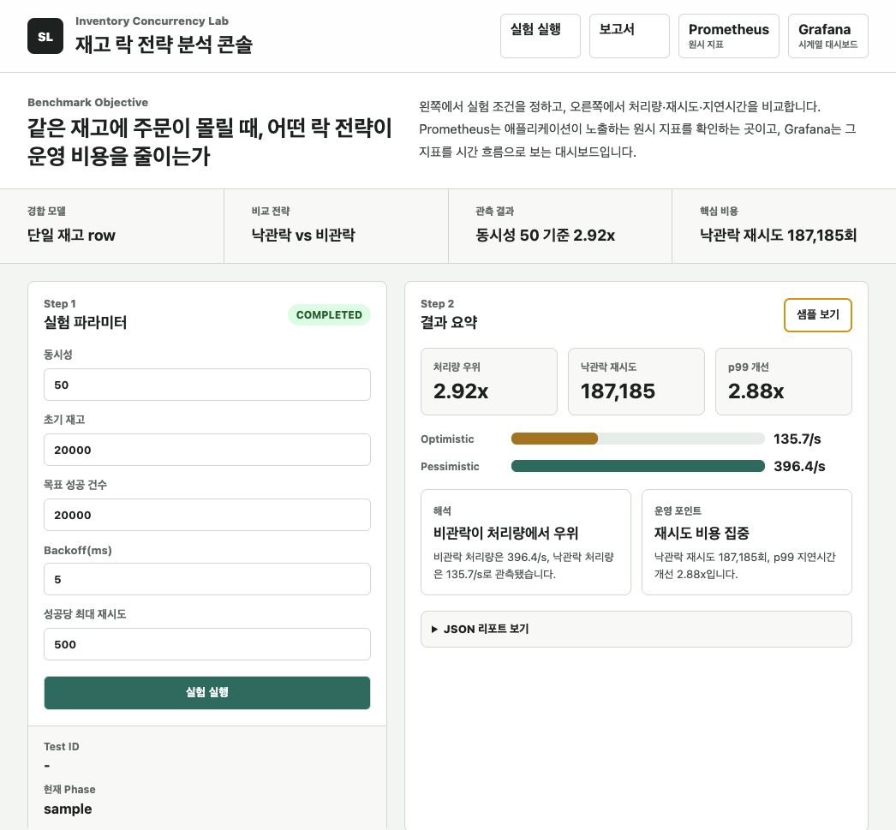
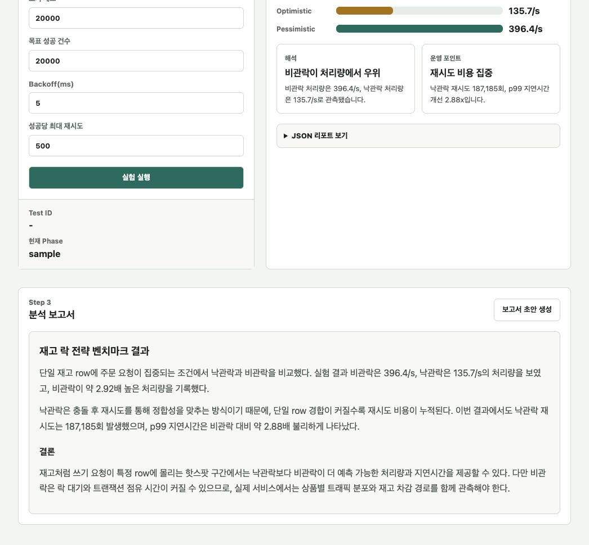

# Stock Lock Benchmark

단일 재고 row에 주문 요청이 몰리는 핫스팟 상황을 만들고, Optimistic Lock과 Pessimistic Lock의 처리량, 지연시간, 재시도 비용을 비교한 Spring Boot 기반 실험 프로젝트입니다.

## Portfolio Positioning

이 레포는 취업용 포트폴리오에서 **백엔드 동시성 제어를 실험과 지표로 설명하는 역량**을 보여주기 위한 프로젝트입니다.

| 평가 포인트 | 이 프로젝트에서 보여주는 내용 |
| --- | --- |
| 동시성 문제 정의 | 단일 재고 row 핫스팟 상황을 명시적으로 모델링 |
| 전략 비교 | Optimistic Lock과 Pessimistic Lock을 같은 조건에서 비교 |
| 지표 기반 해석 | throughput, avg latency, p95/p99, retry 수, 성공당 시도 횟수 분석 |
| 운영 관점 설명 | 콘솔, 리포트, Grafana/Prometheus 구성으로 결과를 의사결정 자료처럼 정리 |
| 설계 설명력 | “어떤 락이 좋은가”가 아니라 “어떤 조건에서 어떤 비용이 생기는가”를 설명 |






## 핵심 결과

동시성 50 기준으로 Pessimistic Lock은 Optimistic Lock보다 약 `2.92x` 높은 성공 처리량을 보였고, Optimistic Lock은 `187,185`회의 재시도를 만들었습니다. 동시성 100에서는 처리량 격차가 약 `3.55x`까지 벌어졌습니다.

이 결과는 “비관락이 항상 낫다”는 결론이 아니라, 단일 row에 쓰기 요청이 집중되는 재고 핫스팟에서는 낙관락의 재시도 비용이 빠르게 커질 수 있음을 보여줍니다.

## 직접 실행

```bash
docker compose up --build -d
```

실행 후 브라우저에서 확인합니다.

| Target | URL |
| --- | --- |
| 실험 UI | http://localhost:18081 |
| Prometheus | http://localhost:19090 |
| Grafana | http://localhost:13000 |

UI에서 동시성, 초기 재고, 목표 성공 건수, backoff, 최대 재시도 횟수를 입력하고 실험을 시작할 수 있습니다. 실험은 `optimistic -> reset -> pessimistic` 순서로 실행되며, 완료 후 JSON 리포트가 화면에 표시됩니다.

## API

```bash
curl -X POST http://localhost:18081/api/tests/start \
  -H "Content-Type: application/json" \
  -d '{"concurrency":50,"initialStock":20000,"backoffMillis":5,"maxRetriesPerSuccess":500,"targetSuccessCount":20000}'
```

```bash
curl http://localhost:18081/api/tests/{testId}
curl http://localhost:18081/api/tests/{testId}/report
```

## 구조

```text
src/main/java/.../domain        Stock aggregate
src/main/java/.../repository    JPA optimistic/pessimistic lock access
src/main/java/.../service       Benchmark runner and report generation
src/main/java/.../api           Test start/status/report API
src/main/resources/static       Browser UI
report                          Saved benchmark snapshots
grafana                         Provisioned dashboard
prometheus                      Scrape configuration
docs                            Report and runbook
```

## 기술 스택

- Java 17
- Spring Boot
- Spring Data JPA
- PostgreSQL
- Micrometer / Prometheus / Grafana
- Docker Compose

## 문서

- [Benchmark Report](docs/benchmark-report.md)
- [Runbook](docs/runbook.md)

## 검증

```bash
./gradlew test
```

CI는 GitHub Actions에서 동일한 테스트를 실행합니다.
