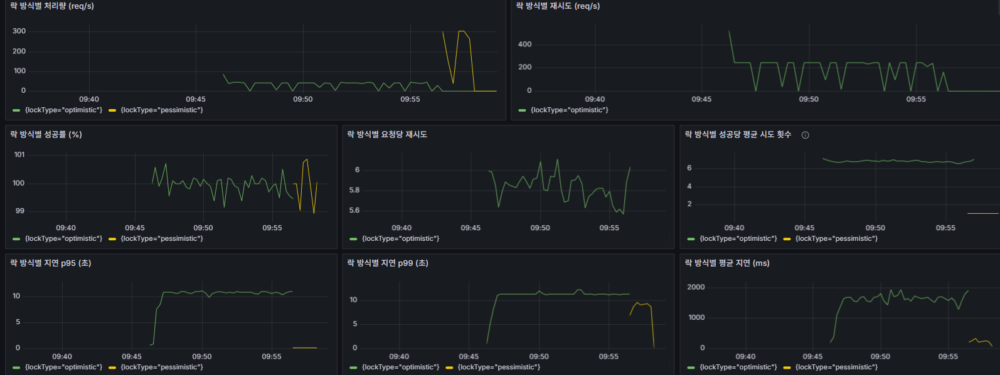

# 단일 Row 핫스팟 재고 차감 벤치마크 보고서

## 1) 실험 목적

본 실험의 목적은 **단일 재고 row(핫스팟)**에 대해 다수의 동시 요청이 **재고 차감(update)**을 수행할 때,

- **낙관적 락(Optimistic Lock, 충돌 시 재시도)**과
- **비관적 락(Pessimistic Lock, 락 대기 기반 직렬화)**

두 전략이 **락 경합을 처리하는 방식 차이**로 인해 어떤 성능 특성(처리량/지연/tail/재시도 비용)을 보이는지 정량적으로 비교하는 것이다.

---

## 2) 실험 설계 및 파라미터

### 2.1 공통 설정(5개 실험 동일)

- 초기 재고: `initialStock = 20000`
- 목표 성공 건수: `targetSuccessCount = 20000` (재고를 0까지 소진)
- backoff: `backoffMillis = 5ms`
- 재시도 한도: `maxRetriesPerSuccess = 500`
- 각 동시성(concurrency)마다 **Optimistic → Pessimistic** 두 Phase를 측정

### 2.2 동시성 스윕(독립 변수)

- concurrency = **5 / 10 / 30 / 50 / 100**

### 2.3 실패(`return_false`)의 의미(중요)

모든 실험에서 `totalRequests > targetSuccessCount`이고 `failuresByReason.return_false`가 존재한다.
이는 보통,

- 목표 성공(20000)에 도달하는 순간에도 일부 요청이 **이미 in-flight** 상태이며
- 그 요청들이 재고 0 상태를 만나 정상적으로 차감에 실패(`false`)로 종료되는
  **종료 조건이 만든 자연스러운 거절**로 해석된다.  
  (즉, 시스템 오류라기보다는 테스트 러너의 종료/경쟁 상황에서 발생하는 정상 케이스)

성공률은 successRate = successCount / totalRequests 로 계산한다.

---

## 3) 결과

### 3.1 동시성별 성능/비용 지표

Concurrency 50일 때의 그라파나 그래프


단위: latency=ms, duration=s

| Concurrency | Phase       | Duration(s) | Throughput (success/s) | Avg Success Lat | p95 (success) | p99 (success) | Avg Attempts/Success | Total Retries | Total Backoff(ms) | return_false |
|------------:|-------------|------------:|-----------------------:|----------------:|--------------:|--------------:|---------------------:|--------------:|------------------:|-------------:|
|           5 | optimistic  |      53.540 |                373.552 |          12.741 |            69 |           244 |                2.232 |        24,668 |           123,340 |            4 |
|           5 | pessimistic |      41.752 |                479.019 |          10.104 |            32 |            68 |                1.000 |             0 |                 0 |            4 |
|          10 | optimistic  |      68.077 |                293.785 |          33.087 |            17 |           924 |                2.950 |        39,466 |           197,330 |            9 |
|          10 | pessimistic |      42.183 |                474.125 |          20.699 |           136 |           286 |                1.000 |             0 |                 0 |            9 |
|          30 | optimistic  |     127.798 |                156.497 |         190.758 |           635 |         1,013 |                9.092 |       162,138 |           810,690 |           29 |
|          30 | pessimistic |      45.129 |                443.174 |          66.970 |           205 |           322 |                1.000 |             0 |                 0 |           29 |
|          50 | optimistic  |     147.399 |                135.686 |         366.722 |         1,163 |         1,822 |               10.328 |       187,185 |           935,925 |           49 |
|          50 | pessimistic |      50.455 |                396.393 |         125.145 |           410 |           633 |                1.000 |             0 |                 0 |           49 |
|         100 | optimistic  |     178.095 |                112.300 |         880.411 |         2,886 |         4,677 |               11.942 |       221,179 |         1,105,895 |           99 |
|         100 | pessimistic |      50.144 |                398.851 |         248.201 |           756 |         1,206 |                1.000 |             0 |                 0 |           99 |

---

## 4) 비교 분석

### 4.1 처리량(Throughput): 동시성 증가에 따른 격차

비관적 락이 낙관적 락 대비 처리량이 얼마나 높은지(배수):

| Concurrency | TP_pess / TP_opt |
|------------:|-----------------:|
|           5 |            1.28× |
|          10 |            1.61× |
|          30 |            2.83× |
|          50 |            2.92× |
|         100 |            3.55× |

해석:

- 동시성이 낮을 때(5~10)는 낙관락의 재시도가 관리 가능한 수준이라 격차가 작다.
- 동시성이 30 이상으로 올라가면 단일 row 충돌 확률이 급증하며, 낙관락은 **재시도·backoff 누적 비용**으로 성능이 악화된다.
- 비관락은 락 대기를 통해 경합을 흡수하여 재시도 폭발이 없으므로 처리량이 안정적이다.

### 4.2 지연시간(Latency)

평균 성공 지연시간 비율(낙관/비관):

| Concurrency | Lat_opt / Lat_pess |
|------------:|-------------------:|
|           5 |              1.26× |
|          10 |              1.60× |
|          30 |              2.85× |
|          50 |              2.93× |
|         100 |              3.55× |

예: concurrency=100에서 p99는 낙관락 4677ms, 비관락 1206ms로 약 3.9배 차이가 난다.

### 4.3 재시도 비용

낙관락의 평균 시도 횟수:

- concurrency=5: 2.23 attempts/success
- concurrency=30: 9.09 attempts/success
- concurrency=100: 11.94 attempts/success

성공 1건을 위해 여러 번 시도해야 하므로 DB 입장에서는 불필요한 업데이트 시도/롤백/재조회가 증가하고,
애플리케이션 입장에서는 backoff 대기가 누적되어 처리량과 tail이 악화된다.

### 4.4 특이점: concurrency=10의 tail

concurrency=10에서 낙관락 p95는 낮지만 p99가 매우 크다(예: p95=17ms, p99=924ms).
이는 대부분은 빠르지만 일부 요청이 충돌 연속으로 긴 꼬리를 만드는 패턴이다.

---

## 5) 결론

- 단일 row 핫스팟 재고 차감에서 동시성이 커질수록 낙관적 락은 재시도/백오프 비용이 비선형적으로 증가하여 처리량과 tail이 악화된다.
- 동일 조건에서 비관적 락은 락 대기를 통해 경합을 직렬화하여 재시도 비용 없이 더 안정적인 처리량과 지연을 유지하며, concurrency=100에서는 처리가 약 3.55배 높았다.

---

## 6) 한계 및 공정성

### 핫스팟 전제의 한계

본 실험은 단일 상품(단일 row)에 요청이 집중되는 핫스팟을 전제로 한다. 따라서 결과를 전체 트래픽에서의 우열로 일반화하면 안 된다.

### 환경 의존성

관측된 처리량/지연시간은 애플리케이션·DB 리소스에 크게 좌우된다. 아래 설정에 따라 결과가 달라질 수 있으므로 보고서에 함께 명시하는 것이 바람직하다:

- HikariCP 풀 크기
- 서버 스레드(톰캣 등)
- DB CPU/IO
- 트랜잭션 격리 수준

### `return_false`의 의미

`return_false`는 시스템 오류가 아니라 재고가 이미 소진된 뒤 도착한 in-flight 요청이 구매에 실패한 정상 결과로 본다. 따라서 비교의 핵심은 실패율 자체가 아니라 성공 처리 성능(
throughput/latency)과 재시도 비용에 있다.

---

## 7) Docker Compose로 빠른 실행

이 저장소의 `docker-compose.yml`을 사용하면 다음 서비스를 함께 띄워 실험을 재현할 수 있다:

- postgres: PostgreSQL (postgres:16)
- app: 애플리케이션 (로컬 빌드)
- prometheus: 메트릭 수집
- grafana: 대시보드(프로비저닝 포함)

포트 요약:

- 애플리케이션: 8080
- PostgreSQL: 5432
- Prometheus: 9090
- Grafana: 3000

사전 준비:

1. Docker 및 Docker Compose(또는 Docker Desktop)를 설치한다.
2. 도커가 컨테이너 내에서 빌드하므로 호스트에 Gradle을 반드시 설치할 필요는 없다.

빠른 실행 (PowerShell 예):

```powershell
# 저장소 루트에서
docker compose up --build -d

docker compose logs -f app
```

실행 후 확인 포인트:

- `docker compose ps`로 `postgres` 상태 확인
- 애플리케이션 로그에 `Started StockLockBenchmarkApplication` 등 Spring Boot 시작 메시지 확인
- Prometheus/Grafana 접속: http://localhost:9090, http://localhost:3000

데이터베이스 접속 정보 (기본값):

- DB 이름: stockbench
- 사용자: stockbench
- 비밀번호: stockbench
- 호스트: localhost
- 포트: 5432

간단 테스트:

애플리케이션 기동 후 제공되는 API(예: 벤치마크 실행 엔드포인트)를 호출하여 실험을 시작한다.

```bash
curl -X POST http://localhost:8080/api/tests/start \
  -H "Content-Type: application/json" \
  -d '{"concurrency":50,"initialStock":20000,"backoffMillis":5,"maxRetriesPerSuccess":500,"targetSuccessCount":20000}'
```

- `concurrency` : Integer, 1 ~ 500
- `initialStock` : Long, 1 ~ 10_000_000
- `backoffMillis` : Integer, 0 ~ 10_000
- `maxRetriesPerSuccess` : Integer, 0 ~ 1_000_000
- `targetSuccessCount` : Long, 1 ~ 10_000_000